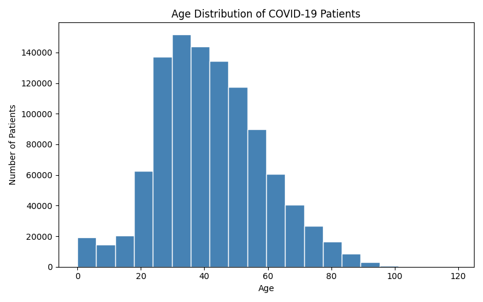
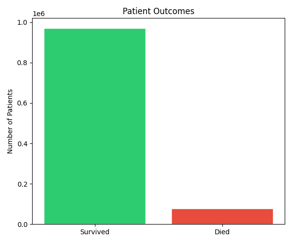
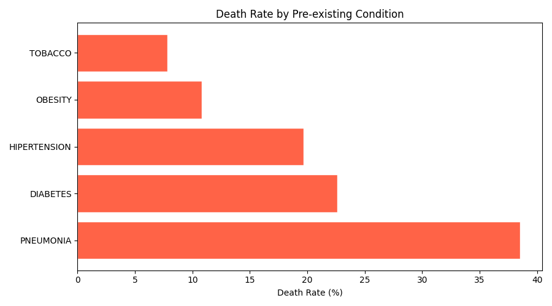

# 🧬 COVID-19 Clinical Data Analyzer

> A Python-based bioinformatics project that analyzes *1 million+ real COVID-19 patient records* to uncover mortality risk factors and clinical patterns.

---

## 📌 Project Overview

This project performs data analysis on a real COVID-19 clinical dataset from Mexico to answer:
- Which pre-existing conditions increase death risk the most?
- What is the overall mortality rate?
- How does age affect COVID-19 outcomes?

---

## 📊 Key Results

| Finding | Value |
|--------|-------|
| Total Patients Analyzed | 1,048,569 |
| Overall Death Rate | 7.34% |
| Pneumonia Death Rate | 38.5% highest |
| Diabetes Death Rate | 22.6% |
| Hypertension Death Rate | 19.7% |
| Average Patient Age | 41.8 years |

---

## 📈 Visualizations

### Age Distribution

### Patient Outcomes

### Death Rate by Condition

---

## 🤖 Clinical Insights

1. *Pneumonia* is the strongest mortality predictor at 38.5% death rate
2. *Elderly patients* consistently show higher mortality risk
3. *Diabetes + Hypertension* together form a high-risk combination
4. Early identification of high-risk patients can help prioritize ICU resources

> This is an educational project. Not a substitute for clinical judgment.

---

## 🛠️ Tech Stack

Python 3 · pandas · matplotlib

---

## How to Run

*Step 1 - Install libraries*
bash
pip install pandas matplotlib

*Step 2 - Download dataset*

Get Covid Data.csv from [Kaggle](https://www.kaggle.com/datasets/meirnizri/covid19-dataset)

*Step 3 - Run*
bash
python analysis.py

---

## 📁 Project Structure

Bioinformatics-projects/
├── analysis.py
├── age_distribution.png
├── survival_outcome.png
├── death_rate_by_condition.png
└── README.md

---

## 🔮 Future Work

- Integrate Claude API for LLM-generated clinical insights
- Build a patient risk score predictor
- Add interactive dashboard using Streamlit

---

## Author

*Kirti* — Bioinformatics Enthusiast
GitHub: https://github.com/Kirti550-bio

